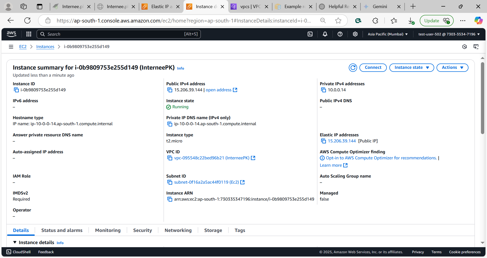
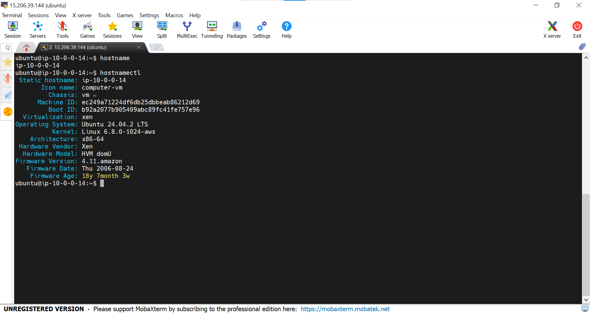
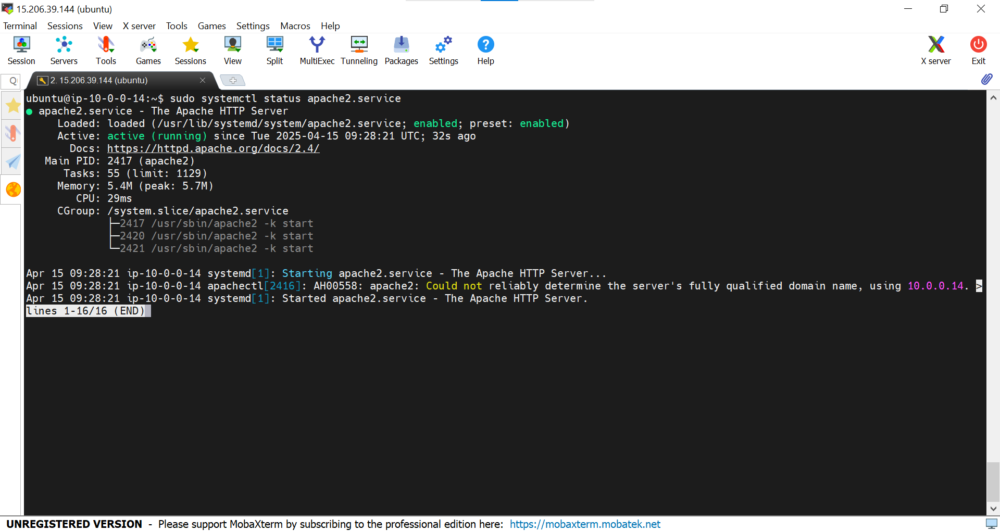
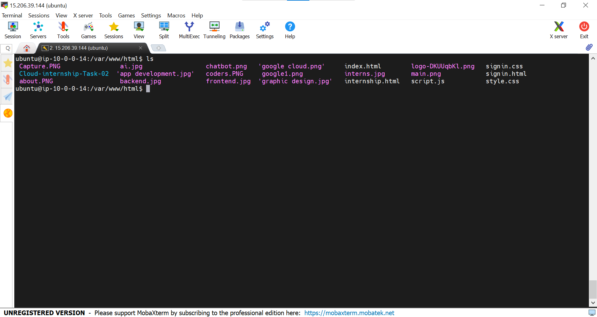
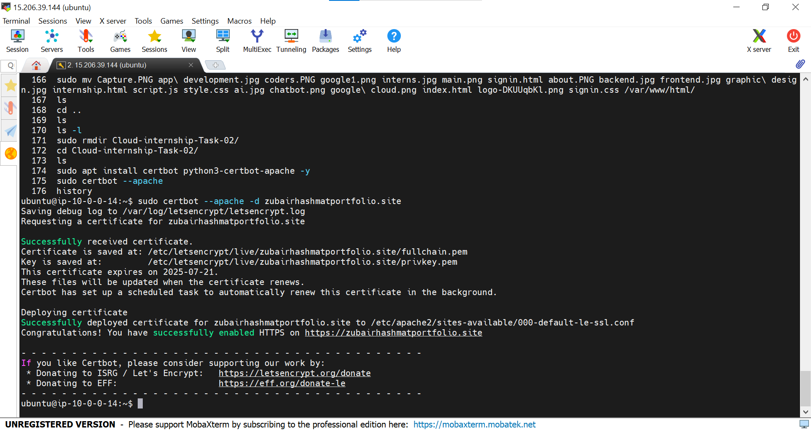
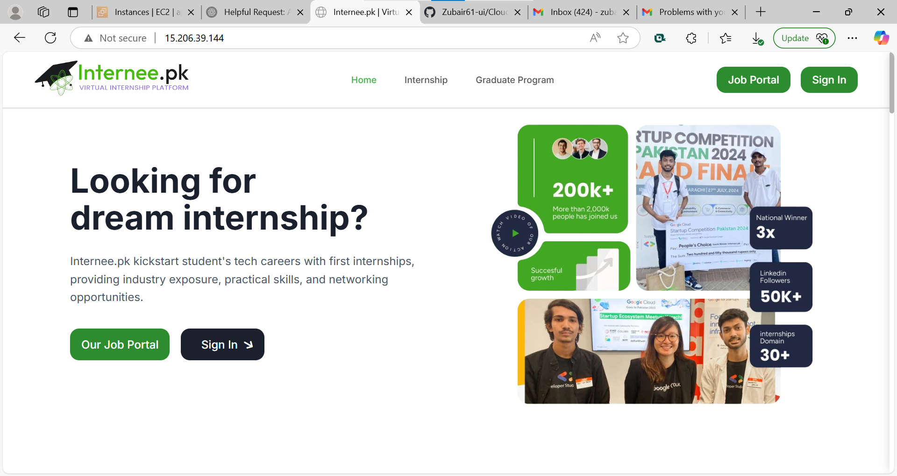

# 🌐 Secure Website Hosting on AWS EC2

This project demonstrates how to deploy and secure a personal website on the cloud using an **EC2 Ubuntu Server** on **AWS**. The website is hosted via **Apache**, and SSL is configured with **Let's Encrypt** for secure HTTPS access. A domain purchased from **Hostinger** is used to access the website publicly.

---

## 🚀 Project Steps

### 1️⃣ Launch EC2 Instance on AWS
- Provisioned an EC2 instance using Ubuntu.
- Configured a **Security Group** to allow:
  - `HTTP (80)`
  - `HTTPS (443)`
  - `SSH (22)`


### 2️⃣ Connect to EC2 via SSH
- Used **MobaXterm** to SSH into the EC2 instance:
  ```bash
  ssh -i your-key.pem ubuntu@your-ec2-public-ip
  ```


### 3️⃣ Install Apache Web Server
- Updated the system and installed Apache:
  ```bash
  sudo apt update
  sudo apt install apache2 -y
  ```
  
- Enabled and started Apache:
  ```bash
  sudo systemctl enable apache2
  sudo systemctl start apache2
  ```


### 4️⃣ Upload Website Files
- Uploaded all website files to the Apache default directory:
  ```bash
  sudo cp -r your-website-files/* /var/www/html/
  ```


### 5️⃣ Configure Domain & SSL (HTTPS)
- **Domain:** Purchased from **Hostinger** and pointed to the EC2 public IP using an A record.
- **SSL:** Installed **Let’s Encrypt SSL Certificate** using Certbot:
  ```bash
  sudo apt install certbot python3-certbot-apache -y
  sudo certbot --apache
  ```

- Verified automatic renewal:
  ```bash
  sudo certbot renew --dry-run
  ```


---

## 🌐 Final Output
✅ Website live and accessible via domain with HTTPS enabled.

---

## 🛠️ Tools & Services Used

- AWS EC2 (Ubuntu)
- Apache Web Server
- Let’s Encrypt (SSL)
- MobaXterm (SSH Client)
- Hostinger (Domain Provider)

---

## 📌 Author
**Zubair Hashmat**  
Cloud Computing Enthusiast 🚀

---

## 📄 License
This project is open-source and available under the [MIT License](LICENSE).
